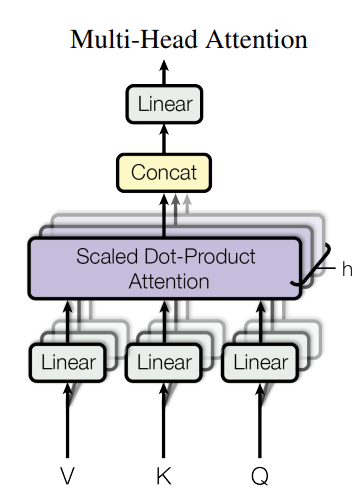
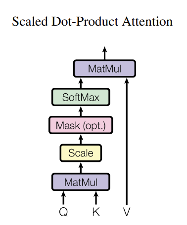

# Transformer Implementation

A PyTorch implementation of the Transformer architecture as described in "Attention is All You Need".

## Project Structure
```
Transformer/
├── layers/           # Core building blocks of the Transformer
│   ├── multi_head_attention.py
│   └── README.md
├── requirements.txt  # Project dependencies
└── README.md        # This file
```

## Multi-Head Attention
 

## Documentation
Each directory contains its own README.md file with detailed information about its contents and purpose. 