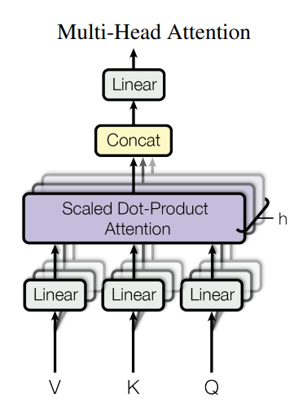
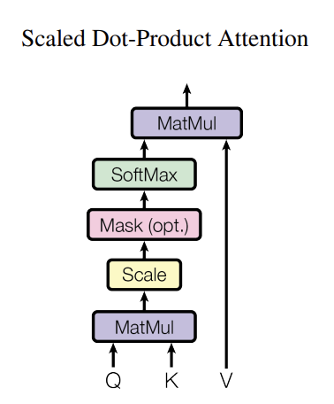

https://arxiv.org/pdf/1706.03762

https://medium.com/data-science/all-you-need-to-know-about-attention-and-transformers-in-depth-understanding-part-1-552f0b41d021

## Multi-Head attention

q:[batch, seq_len, d_model]

Q:[batch, seq_len, d_model]

dv=dk=d_model/num_head

Qi=[batch, seq_len, num_head, dk] → [batch, num_head, seq_len, dk]

(QK)= [batch, num_head, seq_len, seq_len]

softmax()V = [batch, num_head, seq_len, dk]

concatenate = [batch, seq_len, d_model]

## Position Encoding

##Feed-Forward Networks